# FlightClaimly — Complete System Process Map

**Purpose:** A developer should be able to open this file and understand how FlightClaimly's systems, data, generators, APIs, claims flow, aviation knowledge, SEO and publication pipeline talk to each other.

**Created:** 2026-09-01  
**Document type:** Living architecture map  
**Maintenance rule:** Update after meaningful architecture/process changes. `docs/CURRENT_SPRINT.md` is still the current-work/recovery checkpoint; `docs/CLAIMS_DESK.md` contains operational claims detail.

---

# 1. FlightClaimly in one map

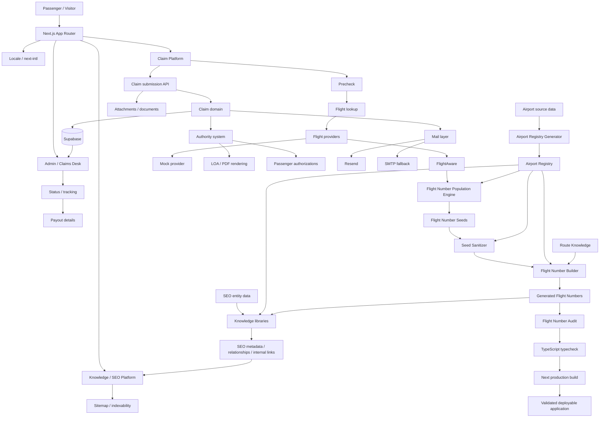

FlightClaimly therefore has two major product domains sharing one application:

1. **Claim Platform** — eligibility, flight lookup, claim submission, documents, authority, customer tracking, admin, airline processing and payout.
2. **Knowledge/Acquisition Platform** — structured aviation entities, routes, flight numbers, passenger-rights knowledge, SEO relationships and programmatic pages.

They may share aviation primitives, but transactional claim state must not become coupled to SEO publication state.

---

# 2. Layer model

## Knowledge / aviation side

```text
External data / source datasets
        ↓
scripts/* population + generators
        ↓
src/data/master/* canonical/generated master data
        ↓
src/data/seo/* structured SEO entities
        ↓
src/lib/knowledge/* domain relationships
        ↓
src/lib/seo/* metadata / internal links / alternates
        ↓
src/app/[locale]/* page templates
        ↓
src/app/sitemap.ts + robots.ts
        ↓
Search engines / users
```

## Claims side

```text
Customer UI
    ↓
src/app/api/*
    ↓
src/lib/precheck.ts / claims.ts / flight/* / authority/*
    ↓
Supabase + attachments + authorization state
    ↓
Admin / mail / PDF / tracking / payout / export
```

**Rule:** Page components render and orchestrate. They should not become hidden databases or duplicate domain rules.

---

# 3. Application routing and presentation

Core application infrastructure:

- `src/app/` — Next.js App Router.
- `src/app/[locale]/` — localized public application.
- `src/app/api/` — server/API boundary.
- `src/app/admin/` — internal administration.
- `src/app/sitemap.ts` — sitemap generation.
- `src/app/robots.ts` — crawler rules.
- `src/middleware.ts` — request/locale middleware.
- `src/i18n/` — locale configuration.
- `messages/*.json` — translated messages.
- `src/components/` — reusable UI.

Major public page families include:

```text
/[locale]/
├── check
├── claim
├── passenger-authority
├── airlines
├── airports
├── countries
├── routes
├── flight-numbers
├── delay-reasons
├── delays
├── cancellations
├── compensation
├── track
└── informational/legal pages
```

Programmatic aviation/knowledge pages use reusable entity data rather than hand-authored independent pages.

---

# 4. Claim Platform — exact lifecycle

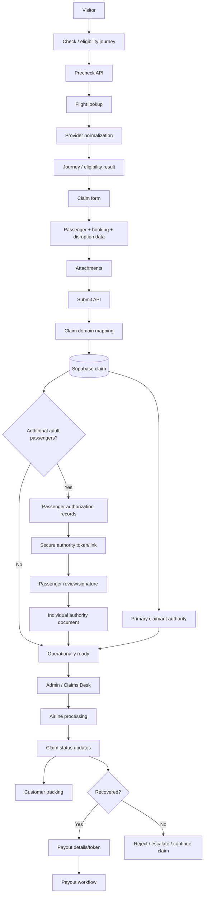

## Claim API boundary

`src/app/api/` contains the server endpoints. Current major groups include:

- `precheck` — pre-claim evaluation.
- `flight` — flight lookup.
- `airports` — airport lookup/support.
- `submit` — claim creation/submission.
- `claims` — claim access/operations.
- `authority` — authority lifecycle.
- `admin` — admin operations.
- `update-status` — operational status mutation.
- `payout` — payout-data flow.
- `export` — claim export.
- `send-track-link` — customer tracking communication.
- `health` — service health.

## Claim domain

`src/lib/claims.ts` is the main Supabase-backed claim domain/mapping layer. A claim currently carries aviation data, customer identity/contact data, booking data, status, locale, attachments, viewer tracking token, airline-send timestamp, compensation/currency, payout data and structured journey/passenger information.

```text
API input
   ↓
Claim domain input
   ↓
toInsert / DB representation
   ↓
Supabase `claims`
   ↓
DB row
   ↓
fromRow
   ↓
Claim domain object
   ↓
Admin / tracking / payout / APIs
```

`src/lib/supabase.ts` exposes two access modes:

```text
supabaseClient()
  → public/anon-key client where appropriate

supabaseAdmin()
  → service-role client
  → server-side privileged operations only
  → no persisted auth session
```

Never expose the service-role key to browser code.

## Attachments

Attachment metadata is associated with claims and includes filename, size, path, upload timestamp and optional content type. File bytes/storage handling belongs to the submission/storage flow; claim records retain the metadata required to locate and display operational evidence.

## Customer tracking

Claims contain a `viewerToken` and creation timestamp. Public tracking must use the intended tokenized access path rather than exposing unrestricted claim IDs/data.

## Status lifecycle

Operational statuses feed admin and customer tracking. Important existing states include `new`, `processing`, `sent_to_airline`, `approved`, `paid_out`, and `rejected`. Status timestamps such as `sentToAirlineAt` support customer timeline rendering and operational history.

## Payout

Payout flow is attached to the parent claim and includes account holder, IBAN, last-four representation, submitted timestamp, and payout token lifecycle fields. Sensitive payout data must remain server-controlled and must never be moved into SEO/static data.

---

# 5. Authority system

Authority is a separate domain under `src/lib/authority/`:

```text
authority/
├── index.ts
├── loa.ts
├── registry.ts
├── resolver.ts
├── rules.ts
└── renderHtmlToPdf.ts
```

Conceptual flow:

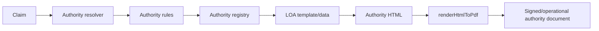

The resolver/rules/registry separation exists so jurisdiction/template selection is not hardcoded into page components.

## Additional passengers

`src/lib/passengerAuthorizations.ts` manages authorization records for additional passengers.

```text
Parent claim
   ├── primary claimant authority
   ├── passenger authorization A → token → signature → document
   ├── passenger authorization B → token → signature → document
   └── shared operational claim
```

**Invariant:** Every adult passenger's authority is individually attributable. A secondary passenger must never overwrite or masquerade as the primary claimant.

## Manual / legacy claims

`src/lib/manualClaims.ts` supports manual claim handling. Manual claims should enter the same downstream architecture:

```text
Manual claim creation
   ↓
normal claim data model
   ↓
authority/passenger authorization
   ↓
admin
   ↓
normal airline processing/status/payout
```

Do not create a parallel authority or payout system for manually created cases.

---

# 6. Email system

`src/lib/mailer.ts` provides one mail interface.

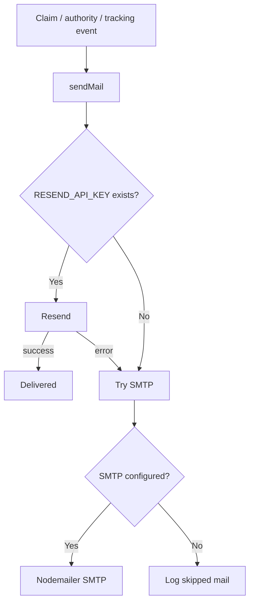

`src/lib/claimNotificationEmail.ts` contains claim-notification content/behavior. Mail provider details must remain behind `sendMail`; callers should not independently implement Resend/SMTP selection.

---

# 7. Flight lookup system

Flight lookup is a runtime service domain separate from generated Flight Number SEO data.

```text
UI / Precheck
   ↓
/api/flight
   ↓
src/lib/flight/types.ts
   ↓
provider implementation
   ├── src/lib/flight/providers/flightaware.ts
   └── src/lib/flight/providers/mock.ts
   ↓
normalized flight result
   ↓
precheck / claim journey
```

FlightAware is therefore used in two different contexts:

1. **Runtime flight lookup** through the provider layer.
2. **Offline/batch Flight Number population** through `scripts/populate-flight-numbers.ts`.

Do not conflate those two responsibilities.

---

# 8. Aviation primitives

`src/lib/aviation/` contains reusable aviation logic:

- `airportCoordinates.ts` — coordinate lookup/access.
- `distance.ts` — distance calculation/banding.
- `passengerRightsCoverage.ts` — passenger-rights coverage logic.

These primitives can be consumed by claims/precheck and by knowledge generation where semantically appropriate. They must not depend on React page components.

---

# 9. Airport Registry — master identity layer

Current airport flow:

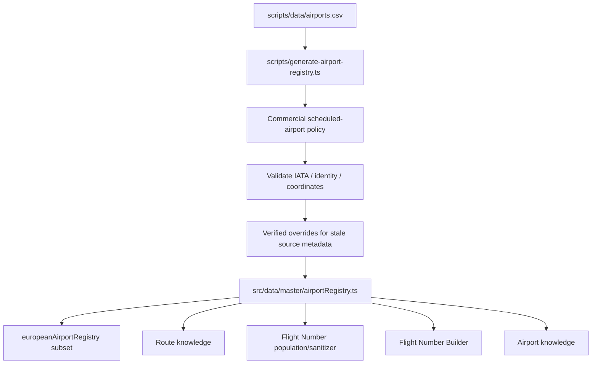

Registry fields include:

- `slug`
- `iata`
- optional `icao`
- `name`
- `city`
- `country`
- `countryCode`
- `continent`
- `isEuropean`
- `type`
- `latitude`
- `longitude`

The registry is **master aviation identity/infrastructure**, not the same thing as rich Airport SEO content.

Current generator policy targets global commercial scheduled airports, filters unsuitable/non-commercial source records, deduplicates by IATA and can inject verified overrides when source metadata is known to be stale or incomplete.

## Dependency invariant

```text
Airport source/master data
        ↓
Airport Registry
        ↓
Route Engine / route knowledge
        ↓
Flight Number Engine
```

A missing Flight Number route must not be fixed with a one-off special case if the actual defect is missing airport identity or route knowledge.

---

# 10. SEO entity data

`src/data/seo/` contains structured SEO-facing entity datasets:

```text
src/data/seo/
├── airlines.ts
├── airports.ts
├── countries.ts
├── routes.ts
└── shared/
```

These are not interchangeable with `src/data/master/*`.

**Master data answers:** what is the canonical aviation entity/fact?  
**SEO data answers:** what structured content/facts are available to render a public knowledge entity?

A master airport may exist without a rich airport SEO page. That is valid and intentional.

---

# 11. Knowledge layer

`src/lib/knowledge/` is the reusable relationship/domain-query layer:

```text
knowledge/
├── airlines.ts
├── airports.ts
├── routes.ts
├── derivedTraits.ts
└── relevance.ts
```

It sits between raw/structured entity data and page/SEO rendering.

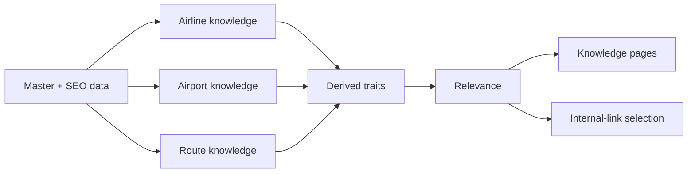

This layer should answer relationship questions such as which airports/routes/airlines are related, rather than making page templates reproduce matching logic.

---

# 12. Route Engine / route knowledge

Routes connect origin and destination airport identities and are a dependency for Flight Number entities.

```text
Airport A + Airport B
       ↓
Route identity / knowledge
       ↓
distance + geographic traits
       ↓
route SEO entity / relationship data
       ↓
Flight Number entity may reference the route
```

Relevant files include:

- `src/data/seo/routes.ts`
- `src/lib/knowledge/routes.ts`
- `src/lib/seo/routes.ts`
- `src/lib/aviation/distance.ts`

The route system should consume airport knowledge; it should not maintain a second competing airport registry.

Avoid generating the full N² Cartesian product of every airport pair. Routes should represent meaningful/known relationships.

---

# 13. Flight Number Population Engine

This is the batch ingestion pipeline used to grow Flight Number coverage.

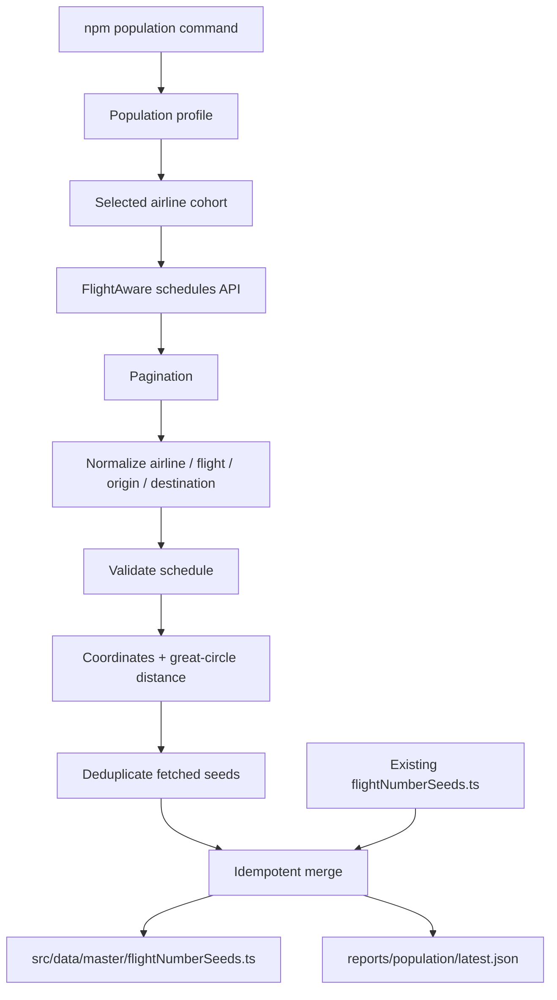

Primary implementation:

- `scripts/populate-flight-numbers.ts`
- `scripts/population-profiles.ts`
- `src/data/master/flightNumberSeeds.ts`
- `reports/population/latest.json`

Current profiles/commands include Nordic and Europe Core cohorts. Population supports pagination, request timeout/robustness, normalization, validation, deduplication, idempotent merge, success/failure reporting and airline selection.

## Identity invariant

A Flight Number identity is airline-scoped:

```text
identity = airline + flightNumber
```

Never assume the numeric/alphanumeric flight number alone is globally unique.

## Seed versus published entity

These are different counts and different layers:

```text
FlightAware schedules
   ↓
normalized seeds
   ↓
flightNumberSeeds.ts
   ↓
sanitization/build
   ↓
flightNumbers.ts
   ↓
publishable Flight Number entities
```

A population report's seed count must not be reported as the final published entity count.

---

# 14. Flight Number sanitization

Command:

```text
npm run sanitize:flight-number-seeds
```

The sanitizer protects the build/publication layer from unsupported or invalid seed relationships while preserving valid source population. Its role is to make seed input compatible with the current master airport/route knowledge without using destructive ad-hoc edits.

```text
raw/merged seeds
    + Airport Registry
    + supported aviation identities
        ↓
seed sanitizer
        ↓
safe Flight Number seed set
```

The sanitizer is a gate, not a replacement for fixing upstream master-data defects.

---

# 15. Flight Number Builder

Command:

```text
npm run build:flight-numbers
```

Primary files:

- `scripts/build-flight-numbers.ts`
- `src/data/master/flightNumberSeeds.ts`
- `src/data/master/flightNumbers.ts`
- `src/lib/flight-numbers.ts`
- `src/lib/flight-numbers/catalog.ts`
- `src/lib/flight-numbers/metadata.ts`

Conceptual build:

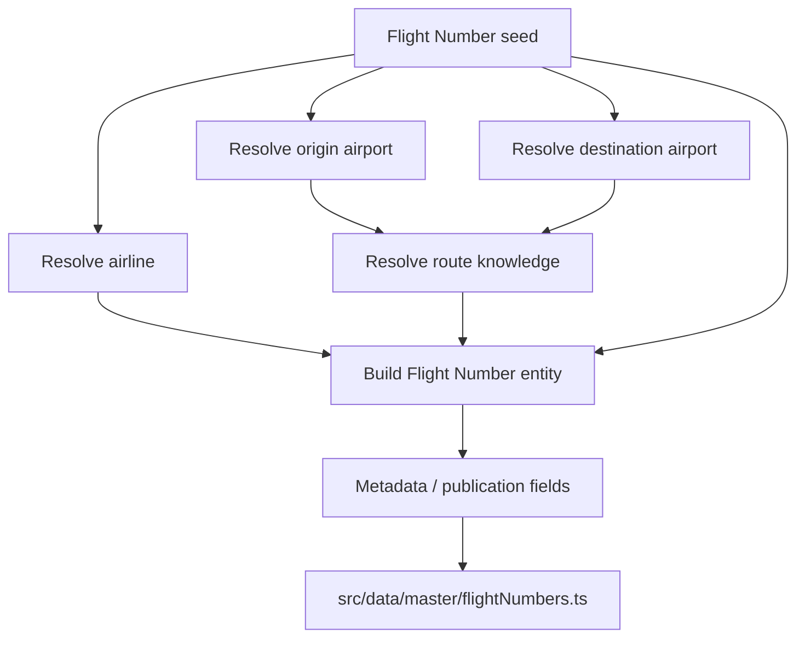

The builder must fail or block invalid relationships rather than silently fabricate airport/route facts.

---

# 16. Flight Number catalog and public pages

Generated Flight Number entities feed a runtime/catalog layer and then page templates:

```text
src/data/master/flightNumbers.ts
        ↓
src/lib/flight-numbers.ts
        ↓
src/lib/flight-numbers/catalog.ts
        ↓
/[locale]/flight-numbers
/[locale]/flight-numbers/[slug]
        ↓
metadata + related entities + internal links
```

`src/lib/flight-numbers/metadata.ts` owns Flight Number-specific metadata concerns rather than putting all metadata construction directly in page files.

---

# 17. SEO layer

`src/lib/seo/` currently contains:

```text
seo/
├── alternates.ts
├── internalLinks.ts
├── metadata.ts
├── relationships.ts
└── routes.ts
```

Responsibilities:

- **metadata.ts** — shared metadata construction.
- **alternates.ts** — locale/canonical alternate handling.
- **relationships.ts** — cross-entity SEO relationships.
- **internalLinks.ts** — deterministic/relevant internal-link selection.
- **routes.ts** — route-specific SEO helpers.

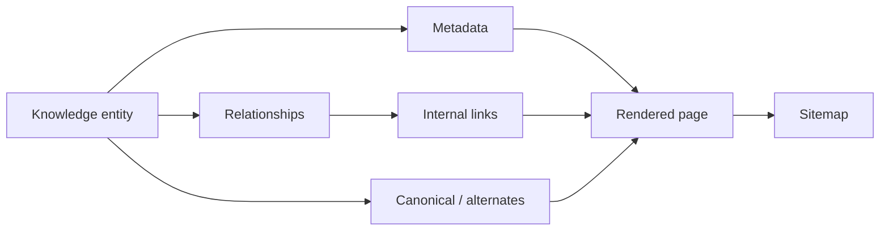

**Invariant:** Runtime indexability, canonical/alternate metadata and sitemap inclusion must describe the same publication policy.

---

# 18. Knowledge entity graph

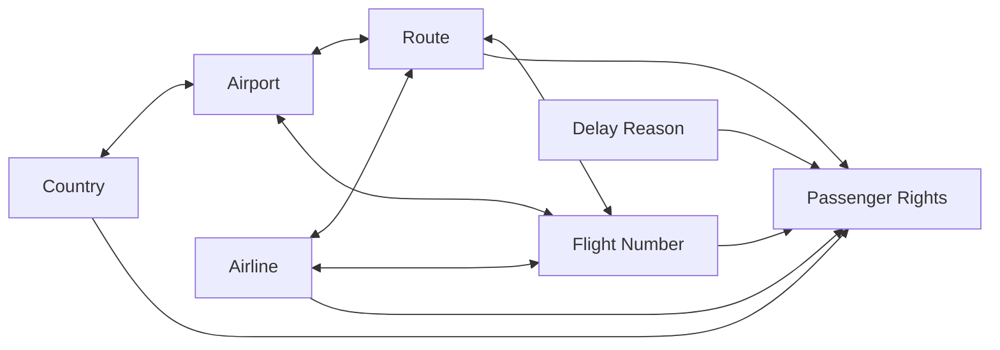

This graph is the conceptual backbone for scalable internal linking. New entity types should connect through explicit relationships, not arbitrary hardcoded links.

---

# 19. Delay Reason Engine

Delay reasons live under both public pages and `src/lib/delay-reasons/`.

Purpose:

```text
Disruption reason
    ↓
structured reason knowledge
    ↓
passenger-rights relevance / extraordinary-circumstance context
    ↓
public educational page
    ↓
claim/check CTA
```

Delay-reason content should not decide an individual claim by itself. Actual eligibility remains claim/precheck/legal logic. Knowledge pages explain; transactional logic evaluates.

---

# 20. Passenger-rights coverage

`src/lib/aviation/passengerRightsCoverage.ts` represents reusable aviation-rights coverage logic.

Conceptually:

```text
origin jurisdiction
+ destination jurisdiction
+ operating airline context
+ route facts
        ↓
coverage logic
        ↓
rights context
```

Keep legal/coverage calculations centralized. Do not duplicate coverage rules independently across airline, airport, route and Flight Number pages.

---

# 21. Publication pipeline

The important package scripts form a controlled pipeline.

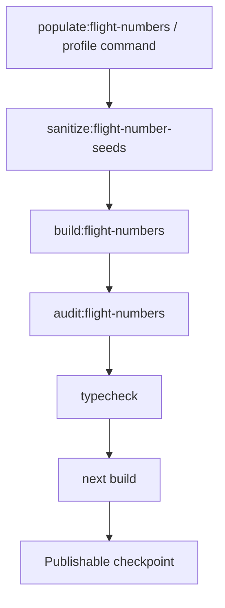

Relevant commands:

```text
npm run populate:flight-numbers
npm run populate:nordics
npm run populate:europe-core
npm run populate:europe-core:pilot
npm run populate:europe-core:scale
npm run sanitize:flight-number-seeds
npm run build:flight-numbers
npm run audit:flight-numbers
npm run build:airport-registry
npm run typecheck
npm run publish:flight-numbers
npm run publish
npm run build
```

`publish:flight-numbers` intentionally chains:

```text
sanitize
→ build flight numbers
→ audit flight numbers
→ TypeScript typecheck
→ full Next.js build
```

This is the safe publication gate for Flight Number changes.

---

# 22. Audit / integrity gates

`scripts/audit-flight-number-scale.ts` checks generated Flight Number scale integrity, including:

- total entities
- publishable entities
- blocked entities
- duplicate slugs
- duplicate airline+flight-number identities
- airlines represented

A Flight Number scale checkpoint is not complete merely because population succeeded. Population, generation, audit, typecheck and production build are separate gates.

General SEO integrity is also supported by diagnostic/audit scripts such as:

- `scripts/audit-seo-data.ts`
- `scripts/diagnose-airline-copy.ts`
- `scripts/diagnose-airline-identities.ts`
- `scripts/diagnose-airport-registry-gaps.ts`
- `scripts/diagnose-seo-gaps.ts`
- `scripts/diagnose-seo-identities.ts`

Diagnostics should reveal upstream data defects; they should not become a collection of permanent special-case patches.

---

# 23. Current Flight Number scale checkpoint

At the 2026-09-01 Europe Core checkpoint:

```text
Population layer:
- Airlines: SK, DY, FR, LH, U2, AF, KL, BA
- Schedules returned: 600
- Valid normalized seeds: 599
- Unique fetched seeds: 555
- Existing seeds before merge: 165
- Seeds added: 436
- Seeds updated: 3
- Seeds unchanged: 116
- Route conflicts: 0
- Total seeds after merge: 601

Generated/publication audit layer:
- Entities: 548
- Publishable: 548
- Blocked: 0
- Duplicate slugs: 0
- Duplicate identities: 0
- Airlines represented: 8
```

The difference between **601 seeds** and **548 generated publishable entities** is intentional as a layer distinction; do not collapse these metrics into one number.

---

# 24. Data ownership matrix

| Concern | Source of truth / owner | Consumers |
|---|---|---|
| Claim records | Supabase via `src/lib/claims.ts` | APIs, admin, tracking, payout |
| Passenger authorization | `src/lib/passengerAuthorizations.ts` + backing persistence | authority UI, admin, PDFs |
| Authority rules/templates | `src/lib/authority/*` | claim/authority flows |
| Mail provider selection | `src/lib/mailer.ts` | claim/authority/tracking notifications |
| Runtime flight lookup | `src/lib/flight/providers/*` | precheck, claim journey |
| Airport identity/master data | `src/data/master/airportRegistry.ts` | routes, Flight Numbers, knowledge |
| Airport coordinates | master/aviation coordinate layer | distance, routes, population |
| Flight Number ingestion | `scripts/populate-flight-numbers.ts` | seed master data |
| Flight Number seed state | `src/data/master/flightNumberSeeds.ts` | sanitizer/builder |
| Flight Number generated entities | `src/data/master/flightNumbers.ts` | catalog/pages/audit |
| Airline SEO entities | `src/data/seo/airlines.ts` | knowledge/pages |
| Airport SEO entities | `src/data/seo/airports.ts` | knowledge/pages |
| Country SEO entities | `src/data/seo/countries.ts` | knowledge/pages |
| Route SEO entities | `src/data/seo/routes.ts` | knowledge/pages |
| Entity relationships | `src/lib/knowledge/*` + `src/lib/seo/relationships.ts` | pages/internal links |
| SEO metadata | `src/lib/seo/*` | page metadata |
| Publication discovery | sitemap/robots | search engines |
| Current engineering checkpoint | `docs/CURRENT_SPRINT.md` | developers / recovery |
| Claims operations | `docs/CLAIMS_DESK.md` | Claims Desk |
| Whole-system architecture | **this file** | developers / architecture |

---

# 25. External systems and boundaries

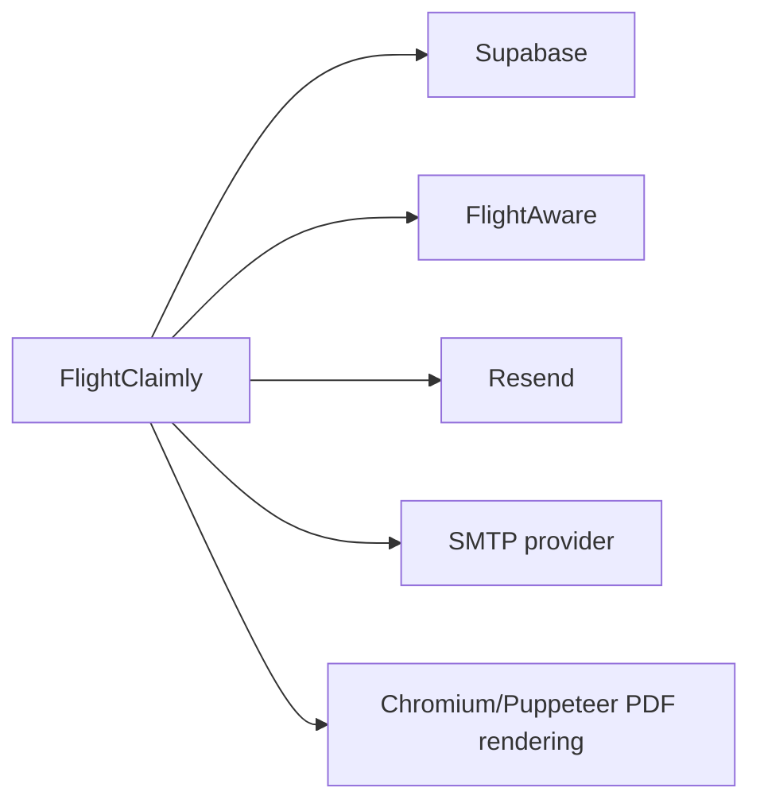

Known technical dependencies include Next.js 15, React 19, TypeScript, Supabase JS, FlightAware integration, Resend, Nodemailer, PDF tooling, Puppeteer/Chromium, Zod, next-intl and CSV parsing.

Environment-backed integrations must be accessed server-side where secrets are involved. `.env.local`/environment configuration is infrastructure, not business data and must never be committed with secrets.

---

# 26. What must NOT talk directly to what

These boundaries are as important as the positive dependency map.

```text
React page ─X→ Supabase service-role secrets
SEO page ─X→ mutate claim state
Flight Number page ─X→ live FlightAware call during static generation
Flight Number seed ─X→ invent missing airport identity
Route Engine ─X→ maintain duplicate private airport registry
Secondary passenger ─X→ overwrite primary claimant authority
Knowledge article ─X→ decide individual claim outcome
Browser/client ─X→ privileged payout mutation
SEO dataset ─X→ store customer PII
Population report ─X→ be treated as final publication count
```

Preferred direction is always:

```text
UI → API/domain → persistence/external service
source → generator → master data → knowledge → SEO → page
```

---

# 27. Change recipes

## Add/repair an airport

```text
1. Determine whether source/master identity is missing or stale.
2. Fix generator/source policy or verified override at the master layer.
3. Rebuild Airport Registry.
4. Verify airport identity and coordinates.
5. Rebuild dependent Flight Numbers if affected.
6. Audit.
7. Typecheck/build.
```

Do **not** first hardcode the airport into a route or Flight Number page.

## Scale Flight Numbers

```text
1. Select population profile/cohort.
2. Run pilot when changing ingestion behavior.
3. Inspect population report.
4. Scale population.
5. Sanitize seeds.
6. Build Flight Numbers.
7. Audit generated entities.
8. Typecheck.
9. Full production build.
10. Commit the validated generated checkpoint.
```

## Add a new knowledge entity type

```text
1. Define canonical entity identity/data ownership.
2. Add structured data/master source.
3. Add knowledge relationships.
4. Add SEO metadata/internal-link behavior.
5. Add reusable list/detail templates.
6. Define indexability/canonical/locale policy.
7. Add sitemap inclusion only when publishable.
8. Add diagnostics/audits.
```

## Change claim behavior

```text
1. Identify domain owner (`claims`, `precheck`, `authority`, etc.).
2. Change server/domain logic first.
3. Keep DB mapping backward-compatible or migrate explicitly.
4. Update API behavior.
5. Update UI last.
6. Verify admin/tracking/email/authority side effects.
7. Typecheck and production build.
```

---

# 28. Failure diagnosis map

```text
"Airport not found"
  → Airport Registry/source/generator first

"Flight-number route not found"
  → airport identity → route knowledge → Flight Number Builder

"Duplicate flight identity"
  → airline + flightNumber identity / population merge

"Population succeeded but entity missing"
  → seed → sanitizer → builder → publication gate

"Page exists but not indexed"
  → publication policy → metadata/canonical → sitemap → robots

"Wrong related links"
  → knowledge relationships / relevance → SEO internalLinks

"Claim missing in admin"
  → submit API → claims mapping → Supabase → admin query

"Authority wrong/missing"
  → claim/passenger auth record → resolver → rules → registry → LOA/PDF

"Email not sent"
  → event/caller → sendMail → Resend → SMTP fallback → environment config

"Tracking cannot open"
  → claim viewer token → tracking route/API → claim lookup

"Payout flow fails"
  → payout token lifecycle → server API → claim payout fields
```

---

# 29. Documentation hierarchy

A developer recovering the project should read in this order:

```text
1. docs/CURRENT_SPRINT.md
   → What are we doing right now? What is safe? What is next?

2. docs/SYSTEM_PROCESS_MAP.md
   → How does the whole system connect?

3. Domain document
   → CLAIMS_DESK / SEO / specific architecture docs

4. Actual implementation files
   → Confirm current code before editing.

5. Git history
   → Why was this architecture introduced?
```

If documentation conflicts with code, stop and inspect the newest relevant commit/current implementation before changing architecture.

---

# 30. Architectural invariants

1. **Master data is upstream.** Fix facts at their source, not in individual pages.
2. **Airport Registry is upstream of routes and Flight Numbers.**
3. **Route knowledge consumes airport identity; it does not own a competing airport list.**
4. **Flight Number identity is `airline + flightNumber`.**
5. **Population seeds are not the same as published Flight Number entities.**
6. **Generators must be deterministic/idempotent where practical.**
7. **Sanitizers are safety gates, not excuses to hide upstream defects.**
8. **Audits must fail unsafe publication states.**
9. **Claims/PII stay in transactional storage, never static SEO datasets.**
10. **Service-role/secrets remain server-side.**
11. **Every adult passenger authorization remains individually attributable.**
12. **Manual claims reuse the main claims architecture.**
13. **Knowledge pages explain; transactional claim logic decides.**
14. **Indexability, canonical policy and sitemap must agree.**
15. **Do not create N² airport route data merely because airports exist.**
16. **Do not solve general architecture problems with one-airport/one-flight special cases.**
17. **A successful API population is not a completed release; audit/typecheck/build remain mandatory.**
18. **Generated files must never be reset/discarded blindly when they represent a validated population checkpoint.**

---

# 31. Developer mental model

When changing FlightClaimly, ask three questions:

### A. What layer owns this fact?

```text
Customer/case fact?       → Supabase / Claim domain
Airport/flight fact?      → Master aviation data
SEO presentation fact?    → SEO data / knowledge layer
Relationship?             → Knowledge/SEO relationship layer
UI-only behavior?         → Component/page
```

### B. What depends on it downstream?

```text
Source → Master → Knowledge → SEO → Page → Sitemap
API → Domain → DB → Admin/Tracking/Payout
```

### C. What validation proves it is safe?

```text
Targeted diagnostic
→ relevant generator/build
→ audit
→ TypeScript typecheck
→ full Next.js production build
```

If a proposed change jumps across these layers, there should be a very explicit reason.

---

# 32. Short version

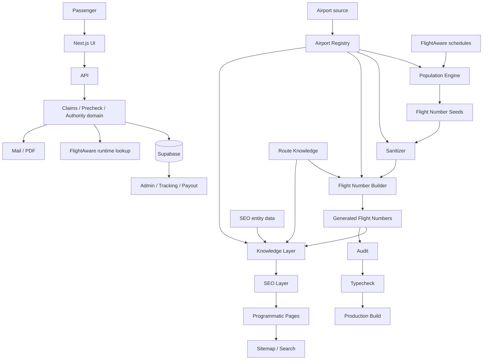

**The governing idea:** FlightClaimly is a layered system. Transactional claims flow inward through APIs to domain logic and persistence. Aviation knowledge flows downward from source/master data through relationships and generators to public pages. The two domains share validated aviation primitives but must not leak responsibilities into each other.
